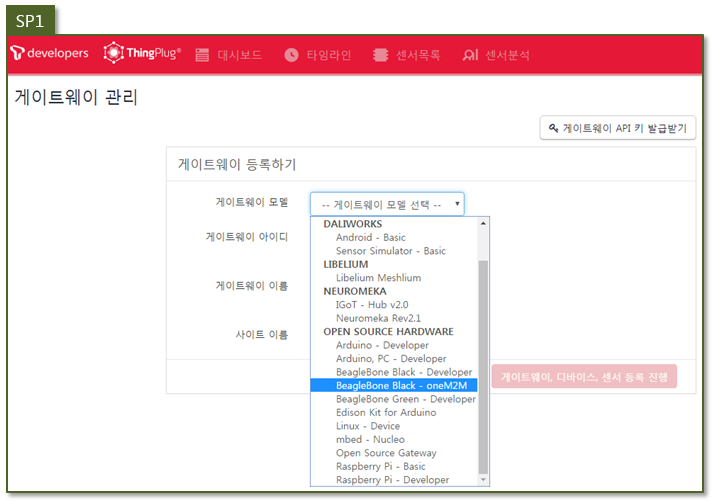
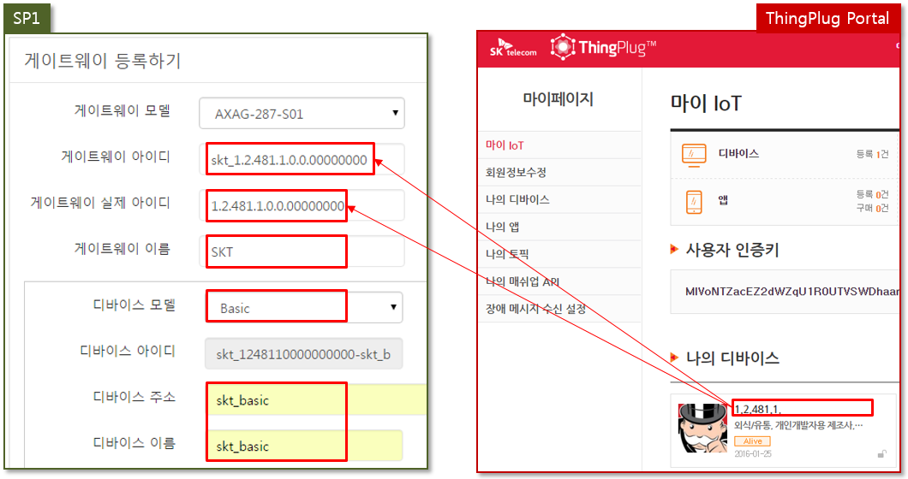

#### 2016년 3월 10일 - Version: 0.9.0

## ThingPlug를 위한 Device 미들웨어 설치 및 실행가이드
본 챕터는 SKT ThingPlug Device 미들웨어 설치 및 실행 방법을 서술한다.

#### 1. 환경 설정

0. 윈도우 사용자의 경우 아래의 URL 에서 putty 를 다운받아 설치한다.
	* http://www.chiark.greenend.org.uk/~sgtatham/putty/download.html
1. 인터넷 연결을 위하여 Ethernet(LAN 케이블)이나 Wi-Fi USB 동글을 장치에 연결한다.
2. 터미널(윈도우 PC에서는 putty)을 열고 각 장치 환경에 따라 네트워크 환경을 설정한다.
3. 처음 실행하는 장치를 업데이트 및 업그레이드 한다.

	```
	# apt-get update
	# apt-get upgrade
	```

#### 2. 미들웨어에서 사용하는 Library 안내
미들웨어에서 사용하는 Library 들은 다음과 같다.
<table>
<thead><tr><th>Part</th><th>Library</th><th>Type</th><th>용도</th></tr></thead>
<tbody>
<tr><td rowspan="7">Gateway Portal</td><td>express</td><td>패키지 포함</td><td>프레임워크</td></tr>
<tr><td>express-session</td><td>패키지 포함</td><td>Express 에 Session 추가</td></tr>
<tr><td>body-parser</td><td>패키지 포함</td><td>Express 에 BodyParser 추가</td></tr>
<tr><td>request</td><td>패키지 포함</td><td>http request 전송</td></tr>
<tr><td>xml2js</td><td>패키지 포함</td><td>XML 파싱</td></tr>
<tr><td>ping</td><td>패키지 포함</td><td>Ping 체크</td></tr>
<tr><td>i18n</td><td>패키지 포함</td><td>다국어 지원</td></tr>
<tr><td rowspan="4">Management Agent</td><td>libcurl</td><td>패키지 포함</td><td>HTTP 통신</td></tr>
<tr><td>libmosquitto</td><td>패키지 포함</td><td>MQTT 통신</td></tr>
<tr><td>libxml2</td><td>shared</td><td>XML 데이터 처리</td></tr>
<tr><td>libsqlite3</td><td>shared</td><td>데이터 저장</td></tr>
<tr><td rowspan="2">공용</td><td>libsodium</td><td>shared</td><td>IPC 통신</td></tr>
<tr><td>lizeromq</td><td>shared</td><td>IPC 통신</td></tr>
</tbody>
</table>

#### 3. 패키지 설치
0. 데비안 패키지 파일을 다운로드 한다.

	```
	# wget https://[TBD]
	```

1. 데비안 패키지를 설치한다.(반드시 root 계정을 이용해야 한다.)	

	* 일반적으로 dpkg 명령을 통하여 패키지를 설치한다.
	```
	# dpkg -i devicemiddleware_arm_1.0.0_20160301.deb
	```
	* Library dependencies 등의 문제가 발생할 경우 gdebi 를 이용하여 패키지를 설치한다.
	```
	# apt-get install gdebi
	# gdebi devicemiddleware_arm_1.0.0_20160301.deb
	```

#### 4. 패키지 설치 확인
브라우저에서 http://IP-address:8000 번으로 접속하여 다음과 같은 화면(Gateway Portal)이 나오면 모든 설치가 완료된 것이다.  

(로그인 화면에서 아이디 / 비밀번호 : thingplugadmin / adminthingplug)

#### 5. 사용 방법
0. 정지

	```
	# service middleware stop
	```

1. 시작

	```
	# service middleware start
	```

2. 재시작

	```
	# service middleware restart
	```

3. 구동 확인

	```
	# ps xl | grep middleware
	```

4. 제거
	* usr/local/middleware 내부의 모든 파일이 삭제되니 필요한 경우 백업이 필요함

	```
	# dpkg -r devicemiddleware
	```
	
5. UART5/HDMI 형식의 센서 사용법
	* BeagleboneBlack에서 HDMI 포트와 UART포트가 겹치는 현상이 있어 둘중에 하나만 사용이 가능하다.
	* 미들웨어 설치시 HDMI포트 자동으로 Disable하고 UART를 Enable 하기 때문에, HDMI를 다시 사용 할 경우 다음과 같은 절차를 따른다.
	```
	# dpkg -r devicemiddleware
	# vi /boot/uEnv.txt

	##Disable HDMI (v3.8.x)
	#cape_disable=capemgr.disable_partno=BB-BONELT-HDMI,BB-BONELT-HDMIN
	```
	(cape_disable 앞에 # 을 추가한 후 reboot 명령어로 재시작하면 HDMI 포트 사용이 가능해짐과 동시에 UART 사용 불가)

----------
#### 5. GMMP 등록
* thingplug.sktiot.com 접속
* 디바이스 개별등록 메뉴를 통하여 등록을 진행한다.


* MAC 주소는 Gateway Portal > 간편세팅의 MAC 주소 정보를 Copy 해서 입력한다.


* 기본 정보와 통신 규격의 필수정보는 모두 입력 후 등록 요청한다.


* 승인완료-단말 Regi. 필요 로 표시되면 Gateway Portal 을 통한 단말 Registration이 가능하다.


* ThingPlug Portal 에서 등록시 사용한 정보를 카피하여 Registration 을 진행한다.


* ThingPlug Portal 마이페이지 > 서비스 정보수정 에서 TCP Listen Port 정보를 카피하여 Registration 을 진행한다.


* Registration 이 정상적으로 완료되면 Step03 으로 이동된다.
* 서비스 시작하기를 클릭한다.


* ThingPlug Portal 에서 등록완료-서비스 가능 문구를 확인한다.


#### 6. oneM2M-SP1 연동
* ThingPlug Portal 에 디바이스 등록이 완료된 후 진행한다.
* openhw.sp1.sktiot.com/ 접속 및 로그인 후 게이트웨이 등록을 진행한다.


* 게이트웨이 모델을 선택한다.


* 나머지 입력란은 아래 예시에 맞추어 입력해 준다.


* 센서 추가는 아래와 같이 Gateway Portal 의 센서정보를 참고하여 추가한다.
* 입력이 완료되면 게이트웨이, 디바이스, 센서 등록 진행 버튼을 통하여 등록을 완료한다.


* 등록이 완료되면 게이트웨이 관리 메뉴에서 확인이 가능하다.


* 대시보드에 게이트웨이/센서/액츄에이터를 다음과 같은 과정으로 추가해준다.

