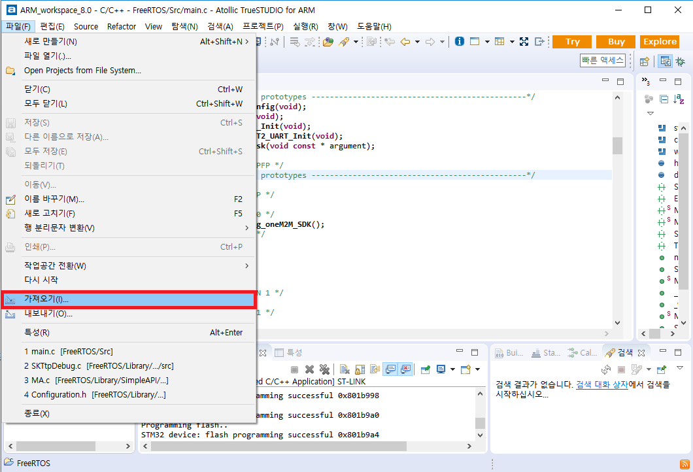
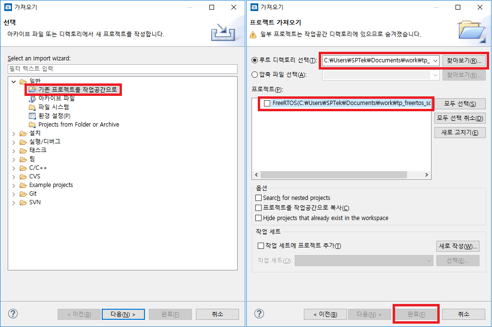

FreeRTOS (+TLS)
===

지원 사양
---
1. 테스트 환경 (mbed)
	+ STMicroelectronics Nucleo-64 F411RE
	+ CPU : 100MHz ARM 32-bit Cortex-M4 with FPU
	+ RAM : 128KB
	+ Flash memory : 512KB

2. 최소 동작 환경
	+ CPU : 50MHz 이상
	+ RAM : 64KB 이상
	+ Flash memory : 256KB 이상

3. Ethernet board
	+ WIZnet W5500 

Library
---
다음 라이브러리들을 사용합니다.

라이브러리 | 용도 | 홈페이지
------------ | ------------- | -------------
__cJSON__ | JSON parser | [cJSON Homepage](https://github.com/DaveGamble/cJSON)
__paho__ | MQTT Embedded-c | [paho Homepage](https://eclipse.org/paho/)
__mbedtls__ | Mbed Tls | [mbed tls Homepage](https://tls.mbed.org/)
__WIZnet_library__ | Ethernet Shield | [WIZnet Homepage](http://www.wiznet.io/ko/product-item/w5500/)
__NTPClient__ | NTP Client | [mbed clien Homepaget](https://os.mbed.com/cookbook/NTP-Client/)

IDE 설정
---

1. Atollic TrueSTUDIO for ARM
    + http://atollic.com/resources/downloads/
    + FreeRTOS homepage에서 추천하고 있음, Eclipse 기반의 embeded 환경 프로그램 개발 tool
2. STM32CubeMX
3. Main board device driver와 FreeRTOS를 포함한 project templete을 생성할 수 있음
    + download - http://www.st.com/content/st_com/en/products/development-tools/software-development-tools/stm32-software-development-tools/stm32-configurators-and-code-generators/stm32cubemx.html
    + 설치 시 아래와 같은 오류 발생 시 command line에서 다음 명령으로 실행
    ~~~
    > java -jar '설치파일명'
    ~~~
4. 설치 후 실행해서 New Project 선택
    + 실행 시 아래와 같은 오류 발생 시 command line에서 다음 명령으로 실행
    ~~~
    > java -jar '실행파일명'
    ~~~
5. Board Selector 탭에서 Vendor:STMicroelectronics, Type of Board:Nucleo64, MCU Series:STM32F4로 설정한 다음 아래 오른쪽 목록에서 NUCLEO-F411RE 선택하고 아래 OK 버튼 클릭
6. 메뉴에서 Help > Install New Libraries를 선택한 후 STM32CubeF4 Releases의 Firmware Package for Family STM32F4를 선택한 다음 Install Now 버튼 클릭
    + library 설치 실패 시 수동 설치 방법
    + download - http://www.st.com/content/st_com/en/products/embedded-software/mcus-embedded-software/stm32-embedded-software/stm32cube-embedded-software/stm32cubef4.html
    + 위의 library 설치 팝업에서 하단의 From Local... 버튼 클릭 후 다운로드 받은 파일 선택
7. 왼쪽 Configuration 리스트 수정
    + '/Middlewares/FREERTOS'의 'Enabled' 체크
    + '/Peripherals/SPI2'의 'Mode'를 'Full-Duplex Master'로 설정
    + '/Peripherals/USART2'의 'Mode를 'Asynchronous'로 설정
8. 메뉴에서 Project > Generate Code를 선택한 후 'Project Name', 'Project Location'을 입력하고 'Toolchain / IDE'를 TrueSTUDIO로 설정 후 OK 버튼 클릭
9. 생성된 project template을 TrueSTUDIO에서 로드
10. Library download
    + STM32CubeMX tool에서 생성된 code 사용
11. project root에 '/Library' directory 생성
12. WIZnet ioLibrary
13. Library download
    + https://github.com/Wiznet/ioLibrary_Driver
14. '/Library/Ethernet_WIZnet' directory 생성
15. 사용 code 추출
    + '/Library/Ethernet_WIZnet' directory에 library의 'Ethernet' directory 복사
    + '/Library/Ethernet_WIZnet' directory에 library의 'Internet' directory 복사
    + 'DHCP', 'DNS', 'SNTP' directory만 사용하고 나머지 directory는 삭제
16. handling 파일 추가
    + Source Tree의 '/Library/Ethernet_WIZnet' directory의 'Board.h', 'W5500HardwareDriver.h', 'W5500HardwareDriver.c', 'wizSystem.h', 'wizSystem.c' 파일을 '/Library/Ethernet_WIZnet' directory에 복사
17.  DNS 환경 설정 변경
    + '/Library/Ethernet_WIZnet/Internet/DNS' directory의 'dns.h' 파일의 MAX_DOMAIN_NAME 값을 '16'에서 '32'로 변경 (ThingPlug domain name 길이가 16보다 크기 때문임)


Sample build
===

Configuration 설정(Library/SimpleAPI/middleware/Configuration.h)
---
MQTT broker 와의 연결을 위한 정보 및 디바이스 정보를 설정해야 합니다.
```c
#define MQTT_HOST                           "218.53.242.111"
#define MQTT_SECURE_HOST                    "ssl://218.53.242.111"
#define MQTT_PORT                           1883
#define MQTT_SECURE_PORT                    8883						
#define MQTT_KEEP_ALIVE                     120
#define MQTT_ENABLE_SERVER_CERT_AUTH        0
#define LOGIN_NAME                          ""
#define SIMPLE_SERVICE_NAME                 ""
#define SIMPLE_DEVICE_NAME                  ""
```

변수 | 값 | 용도 
------------ | ------------- | -------------
__LOGIN_NAME__ | ThingPlug 포털을 통해 발급받은 디바이스 토큰 | MQTT 로그인 사용자명으로 사용
__SIMPLE_SERVICE_NAME__ | ThingPlug 포털을 통해 등록한 서비스명 | MQTT Topic 에 사용
__SIMPLE_DEVICE_NAME__ | ThingPlug 포털을 통해 등록한 디바이스명 | MQTT Topic 에 사용


디바이스 디스크립터와 Attribute, Telemetry
---
각 디바이스의 고유의 특성을 전달하는 Attribute 변경 통지와 센서를 통해 측정된 값을 전달하는 Telemetry 전송 데이터는 ThingPlug 포털에 등록한 디바이스 디스크립터의 내용과 1:1 매칭되어야 합니다.
다음은 포털에 등록된 디바이스 디스크립터와 매칭된 소스코드 예시입니다.

```json
"Airconditioner": {
     "telemetries": [{"name":"temperature","type":"number"}, {"name":"humidity","type":"int"}],
     "attribute": [{"name":"control","type":"string"}]
 }
```

```c
void telemetry() {
    double temp = 27.05;
    int humi = 75;

    ArrayElement* arrayElement = calloc(1, sizeof(ArrayElement));    
    arrayElement->capacity = 2;
    arrayElement->element = calloc(1, sizeof(Element) * arrayElement->capacity);

    Element* item = arrayElement->element + arrayElement->total;
    item->type = JSON_TYPE_DOUBLE;
    item->name = "temperature";	
    item->value = &temp;
    arrayElement->total++;

    item = arrayElement->element + arrayElement->total;
    item->type = JSON_TYPE_LONG;
    item->name = "humidity";
    item->value = &humi;
    arrayElement->total++;
    
    tpSimpleTelemetry(arrayElement, 0);
    free(arrayElement->element);
    free(arrayElement);
}

void attribute() {
    char *status = "stopped";
	
    ArrayElement* arrayElement = calloc(1, sizeof(ArrayElement));    
    arrayElement->capacity = 1;
    arrayElement->element = calloc(1, sizeof(Element) * arrayElement->capacity);
    
    Element* item = arrayElement->element + arrayElement->total;
    item->type = JSON_TYPE_STRING;
    item->name = "control";
    item->value = status;
    arrayElement->total++;

    tpSimpleAttribute(arrayElement);
    free(arrayElement->element);
    free(arrayElement);
}

```

ThingPlug_Simple_SDK 빌드
---

1. IDE에 프로젝스 import 하기
    + 메뉴바 : 파일 -> 가져오기 -> 기존 프로젝트를 작업공간으로 -> git clone 폴더 선택 -> FreeRTOS 프로젝트 선택
    
    
2. 빌드하기
    + 메뉴바 : 프로젝트 -> Build Project
3. 실행하기
    + 메뉴바 : 실행 -> 디버그
    + 메뉴바 : 실행 -> 재개

