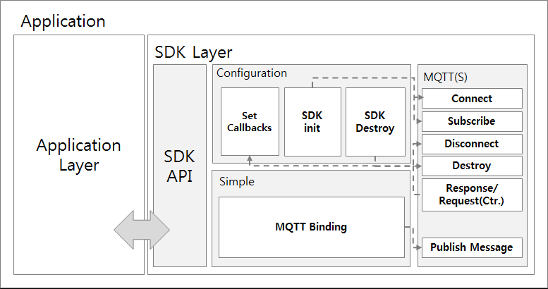

ThingPlug Simple SDK
===
SKT ThingPlug Simple SDK 구조와 API 및 사용법에 대한 내용입니다.

Architect
---

SDK Source Tree
---
+ __Simple__ (ThingPlug Simple SDK root folder)
	+ __middleware__ (middleware sample including makefiles for build)
	+ __lib__ (external libraries - paho, TLS, )
	+ __include__ (Header files of the ThingPlug Simple SDK)
	+ __src__ (Source files of the ThingPlug Simple SDK)
		+ __simple__ (Source files of the ThingPlug Simple API)
		+ __net__ (Source files of the MQTTS)
			
Description
---
Directory | Description
------------ | -------------
Simple | ThingPlug Simple SDK 루트 폴더
middleware |	SDK 를 이용한 미들웨어 샘플 폴더
lib | 외부 라이브러리나 소스들 폴더
include | 동작에 필요한 header 파일들 폴더
src | 전체 소스 폴더
simple | ThingPlug Simple API 소스 폴더
net | MQTT/TLS 관련 소스 폴더

Library
---
MQTT TLS 지원을 위하여 라이브러리를 사용합니다.

지원 환경 | TLS 지원 | MQTT 라이브러리 | TLS 라이브러리
------------ | ------------- | ------------- | -------------
__ARM/Linux__ | __O__ | paho | OpenSSL(to be installed.)
__ARDUINO__ | __X__ | paho |
__mbed__ |	__O__ | paho | mbed TLS
__FreeRTOS__ |	__O__ | paho | mbed TLS

* [paho Homepage](https://eclipse.org/paho/)
* [OpenSSL Homepage](https://www.openssl.org/)
* [mbedTLS Homepage](https://tls.mbed.org/)

API Documentation
---
* [Download](https://github.com/sobhamo/hello-world/raw/master/SDK_Simple/docs/ThingPlug_Simple_SDK_API-20171206.pdf)

Middleware
---
SDK를 사용한 미들웨어 예제는 다음과 같습니다.

* __ThingPlug_Simple_SDK.c__ or __ThingPlug_Simple_SDK.ino__ : ThingPlug Simple SDK 에서 지원하는 API를 모두 테스트해볼 수 있습니다.
	+ __MA__ (미들웨어의 ManagementAgent 역할)
	+ __SRA__ (미들웨어의 SensorManagementAgent 역할)
	+ __SMA__ (미들웨어의 ServiceReadyAgent 역할)

