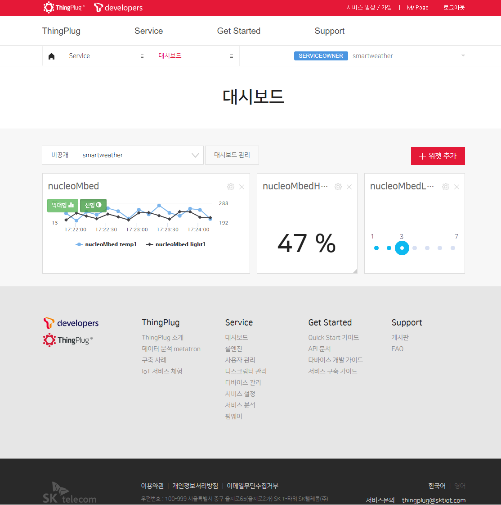

MBED (+TLS)
===

지원 사양
---
1. 테스트 환경
	+ STMicroelectronics Nucleo-64 F411RE
	+ CPU : 100MHz ARM 32-bit Cortex-M4 with FPU
	+ RAM : 128KB
	+ Flash memory : 512KB

2. 최소 동작 환경
	+ CPU : 50MHz 이상
	+ RAM : 64KB 이상
	+ Flash memory : 256KB 이상

3. Ethernet board
	+ WIZnet W5500 

Library
---
다음 라이브러리들을 사용합니다.

라이브러리 | 용도 | 홈페이지
------------ | ------------- | -------------
__cJSON__ | JSON parser | [cJSON Homepage](https://github.com/DaveGamble/cJSON)
__paho__ | MQTT Embedded-c | [paho Homepage](https://eclipse.org/paho/)
__mbedtls__ | Mbed Tls | [mbed tls Homepage](https://tls.mbed.org/)
__WIZnet_library__ | Ethernet Shield | [WIZnet Homepage](http://www.wiznet.io/ko/product-item/w5500/)

Sample build
===

Configuration 설정(Library/SimpleAPI/middleware/Configuration.h)
---
MQTT broker 와의 연결을 위한 정보 및 디바이스 정보를 설정해야 합니다.
```c
#define MQTT_HOST                           ""
#define MQTT_SECURE_HOST                    ""
#define MQTT_PORT                           1883
#define MQTT_SECURE_PORT                    8883						
#define MQTT_KEEP_ALIVE                     120
#define MQTT_ENABLE_SERVER_CERT_AUTH        0
#define LOGIN_NAME                          ""
#define SIMPLE_SERVICE_NAME                 ""
#define SIMPLE_DEVICE_NAME                  ""
```

변수 | 값 | 용도 
------------ | ------------- | -------------
__LOGIN_NAME__ | ThingPlug 포털을 통해 발급받은 디바이스 토큰 | MQTT 로그인 사용자명으로 사용
__SIMPLE_SERVICE_NAME__ | ThingPlug 포털을 통해 등록한 서비스명 | MQTT Topic 에 사용
__SIMPLE_DEVICE_NAME__ | ThingPlug 포털을 통해 등록한 디바이스명 | MQTT Topic 에 사용


디바이스 디스크립터와 Attribute, Telemetry
---
각 디바이스의 고유의 특성을 전달하는 Attribute 변경 통지와 센서를 통해 측정된 값을 전달하는 Telemetry 전송 데이터는 ThingPlug 포털에 등록한 디바이스 디스크립터의 내용과 1:1 매칭되어야 합니다.
다음은 포털에 등록된 디바이스 디스크립터와 매칭된 소스코드 예시입니다.

```json
"Airconditioner": {
     "telemetries": [{"name":"temperature","type":"number"}, {"name":"humidity","type":"int"}],
     "attribute": [{"name":"control","type":"string"}]
 }
```

```c
void telemetry() {
    double temp = 27.05;
    int humi = 75;

    ArrayElement* arrayElement = calloc(1, sizeof(ArrayElement));    
    arrayElement->capacity = 2;
    arrayElement->element = calloc(1, sizeof(Element) * arrayElement->capacity);

    Element* item = arrayElement->element + arrayElement->total;
    item->type = JSON_TYPE_DOUBLE;
    item->name = "temperature";	
    item->value = &temp;
    arrayElement->total++;

    item = arrayElement->element + arrayElement->total;
    item->type = JSON_TYPE_LONG;
    item->name = "humidity";
    item->value = &humi;
    arrayElement->total++;
    
    tpSimpleTelemetry(arrayElement, 0);
    free(arrayElement->element);
    free(arrayElement);
}

void attribute() {
    char *status = "stopped";
	
    ArrayElement* arrayElement = calloc(1, sizeof(ArrayElement));    
    arrayElement->capacity = 1;
    arrayElement->element = calloc(1, sizeof(Element) * arrayElement->capacity);
    
    Element* item = arrayElement->element + arrayElement->total;
    item->type = JSON_TYPE_STRING;
    item->name = "control";
    item->value = status;
    arrayElement->total++;

    tpSimpleAttribute(arrayElement);
    free(arrayElement->element);
    free(arrayElement);
}

```

ThingPlug_Simple_SDK 빌드
---
1. git clone 후 폴더를 압축한다.
2. web compiler : https://os.mbed.com/compiler

	```
	import -> Upload -> AddFile[파일선택] -> 압축한 파일 선택 -> Import!
	```
	
	
2. 빌드

	```
	Complie 버튼클릭
	bin 파일 다운로드
	```
	
	
3. 실행

	```
	다운로드 된 bin파일을 mbed에 복사하면 자동 실행
	시리얼 로그 확인	
	```

ThingPlug_Simple_SDK 실행
---
1. 실행 로그 확인
---

---
2. Thingplug SensorData
---

