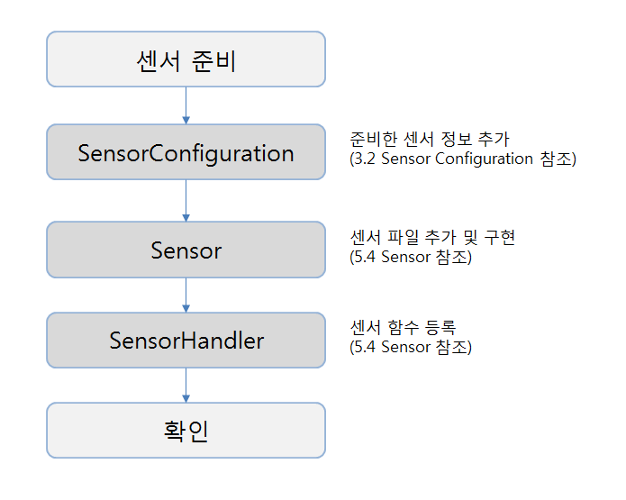

# 센서 연동 가이드

본 챕터는 Sensor 와 Actuator 조회 및 제어를 담당하는 **Sensor Management Agent**(SMA) 에 대한 소개와 직접 수정을위한 가이드를 제공한다.

### 1. 개요
SMA 는 Sensor 들을 관리하고, 데이터를 수집한다.
다양한 센서 입/출력을 처리하기 위한 Common Interface 로 개발하였다. 

### 2. 프로세스 흐름

> **Service Ready Agent**(SRA) 는 SMA 로 부터 센서 관련 정보들을 전달받아, 센서별 정책에 따라 데이터를 가공하는 등의 역할을 하는 Agent 이다.

* SMA 는 IPC Handler를 통하여 SRA 로부터 전달되는 Packet을 수신한다.
* **IPC Handler**는 수신된 Packet 을 Receive Command Queue 에 Push 한다.
* **Command Queue** 는 처리해야 할 Command 가 있는지 확인 한 후, 처리해야 할 Command가 있음을 Command Executer 에게 알린다.
* **Command Executer** 는 Packet Header 를 분석하여, 수행할 Command 인 경우 각 Command Process 에 수신된 Packet 을 전달하여 Command 처리를 요청한다.
* **Command Process** 는 수신된 Packet 을 Extractor 를 통해 분석된 내용을 구조화하고, 구조화된 정보를 이용하여 Command 를 처리한다.
* Command 를 처리할 때 만약 센서 관련 처리가 필요하다면, 이를 **Sensor Handler** 를 통해 수행한다.
* **Sensor Handler** 에서는 처리가 필요한 센서를 찾고, 해당 센서에 대응되는 **Sensor Interface** 를 찾아 실행시키고, 그에 대한 결과값을 리턴한다. 결과값을 바탕으로 Command 를 처리하며, 이 후 Generator를 이용하여 Send Packet을 구성하여 **Command Executer** 에 전달한다.
* **Command Executer** 는 Send Packet 을 Command Queue 에 Push 한다. IPC Handler 는 SRA 로 보낼 Packet 인 경우 Packet을 전송한다.

### 3. 센서 관리 전체 구조도
아래 그림은 센서제어를 위한 모듈의 전체 구조도이다.


#### 3.1. Sensor Handler
* **Sensor Handler** 모듈은 센서 관리의 핵심 역활을 수행한다. 등록된 센서의 초기화, 제어, 데이터 추출, 종료 함수를 관리 및 실행한다.
* **Sensor Interface** 에는 센서 관련 함수가 모여있으며, 각 센서별로 하나의 file 을 갖는다.
* 초기화 시 모든 센서의 초기화 함수를 실행한다.
* 센서의 초기화 함수에서는 자신의 제어명령이 있을 경우, 제어함수를 Control Command List 에 등록한다.
* 각 센서의 초기화가 완료되면, 주기적으로 센서값을 읽는 함수를 알람 시그널에 등록한다.
* 주기적으로 읽는 데이터는 **Configuration** 에 update 된다.
* Command 에 따라 센서 제어가 필요할 경우, **Control Command List** 에서 일치하는 제어함수를 실행한다.
* 주기적으로 해당 센서가 정상동작하는지 확인한다.
* 프로세스가 종료될 때 모든 센서의 종료 함수를 실행한다.

#### 3.2. Sensor Configuration
* Sensor Configuration 은 SMA 에서 동작할 센서에 대한 설정값을 저장한다.
* 관련 코드는 `/usr/local/middleware/SMA/source/configuration/SensorConfiguration.c` 파일에 있으며,
`/usr/local/middleware/conf/SMADeviceConf.backup` 파일이 존재하면 **SMADeviceConf.backup** 파일의 정보로 로딩된다.
* 사용자가 관리하고자 하는 센서목록을 정하고, 이를 Sensor Configuration 에 반영하는 작업은 필수이다.
* 설정 값을 정리하면 다음과 같다.

  * DeviceID : SMA에서 자동으로 세팅하여 사용하기 때문에 필드에 존재하지만 거의 사용하지 않는다.
  * SensorID : 센서를 구분하는 기준값이다. 10자리로 구현되어 있으며 숫자로 되어 있다. 중복되는 값이 들어가지 않도록 한다. (예)0000000001,000000002
  * SensorName : Sensor의 모델명이다. (예) DS18B20, CM1001
  * SensorType : Sensor의 종류를 나타낸다. (예) 온도, 습도
  * EnableFlag : 장치가 활성되었는지 여부.
  * ReadInterval : 센서를 읽는 주기 (초)
  * ReadMode : 센서를 읽는 방식 (예) polling, request, event
  * LastValue : Sensor의 마지막 데이터
  * StartTime : 데이터에 변화가 있는 시점
  * EndTime : 데이터에 변화가 없는 시점
  * SerialNumber : 센서의 시리얼 넘버
  * OperationType : 센서 구동 타입 (예) active, passive
  * MaxInterval : 데이터 변화 없어도 허용되는 최대 시간(초)
  * ControlType : SP1 Control Type 여부
  * RegisterFlag : SMA->SRA->MA로 센서를 등록 할지 여부

* **SENSOR_CONFIGURATION_T** 구조체 구성표
<table>
<thead><tr><th>구조체 멤버</th><th>변수 타입</th><th>기타</th></tr></thead>
<tbody>
<tr><td>DeviceID</td><td>String</td><td>최대길이 32byte</td></tr>
<tr><td>SensorID</td><td>String</td><td>최대길이 32byte</td></tr>
<tr><td>SensorName</td><td>String</td><td>최대길이 64byte</td></tr>
<tr><td>SensorType</td><td>String</td><td>최대길이 32byte</td></tr>
<tr><td>EnableFlag</td><td>Enum</td><td>SENSOR_STATE_DISABLE = 0<br>SENSOR_STATE_ENABLE = 1</td></tr>
<tr><td>ReadInterval</td><td>Int</td><td>seconds</td></tr>
<tr><td>ReadMode</td><td>Enum</td><td>SENSOR_MODE_POLLING = 0<br>SENSOR_MODE_REQUEST = 1<br>SENSOR_MODE_EVENT = 2</td></tr>
<tr><td>LastValue</td><td>String</td><td>MAX_LEN_LAST_VALUE = 32</td></tr>
<tr><td>StartTime</td><td>Int</td><td></td></tr>
<tr><td>EndTime</td><td>Int</td><td></td></tr>
<tr><td>SerialNumber</td><td>String</td><td>MAX_LEN_SERIAL_NUMBER=64</td></tr>
<tr><td>OperationType</td><td>Enum</td><td>SENSOR_ACTIVE_TYPE: 0x0001<br>SENSOR_PASSIVE_TYPE:0x0002</td></tr>
<tr><td>MaxInterval</td><td>Int</td><td>Value < 0 은 경우 on/off 판단불가<br>양수일 경우 시간만큼 Sensor Data 변화 없을 시 off 로 전환</td></tr>
<tr><td>ControlType</td><td>Int</td><td>1 = SP1 Control Type<br>2 = No SP1 Control Type</td></tr>
<tr><td>RegisterFlag</td><td>Int</td><td>0 = MA에 등록하지 않음<br>1 = MA에등록<br>값이 0이면장치에 센서가 연결되어 동작하더라도 MA에는등록하지 않음</td></tr>
</tbody>
</table>

#### 3.3. Sensor Interface
* 센서에 직접적으로 작동하는 함수를 모아놓은 파일이다. 
* 각 센서별로 하나의 파일이 존재하며, 내부적으로 초기화 함수, 제어 함수, 데이터 추출 함수, 종료 함수가 구현된다.
* 구현된 함수를 Sensor Handler 에 등록한다.

#### 3.4. Control Command List
* 센서의 제어명령들을 관리하는 리스트이다.
* 링크 리스트로 구현되어 있으며, Sensor Interface 의 제어명령에 대한 함수명과 함수포인터를 저장하고 있다.
* 제어 명령이 도착하면, 함수명을 확인하고 함수를 호출한다.

#### 3.5. Command
* SRA 에서 센서 관리에 관련된 명령이 도착하면 Command file 에서 Sensor Handler 의 함수를 호출하여, 선택된 센서의 원하는 처리를 진행한다.
* 센서의 값을 확인하거나, 설정을 바꾸거나, 제어를 할 수 있다.


### 4. 센서 처리 흐름


#### 4.1 센서 초기화 및 종료
* 메인 함수 내부에서 Sensor Handler 의 Init 함수를 처음에 호출한다.
* 초기화가 진행될 때 Sensor Configuration 의 SensorID 로 루프를 돌면서 등록된 센서의 초기화함수를 실행한다.
* 종료 함수를 실행하는 루틴도 초기화와 동일하다.

#### 4.2 센서 데이터 추출
* Sensor Interface 내부의 Read 함수를 통해 센서의 데이터를 추출한다. 
* Sensor Handler 에서 알람 시그널에 등록된 센서 데이터 읽기 함수에서는 Sensor Configuration 의 Read Interval 값에 따라 센서 데이터를 추출하여 LastValue 에 저장한다. 또한 센서 정보를 요청하는 Command 가 Sensor Handler 에 함수를 이용하여 바로 센서 데이터를 추출하는 경우도 존재한다.
* 이때 역시 센서 구분은 SensorID 로 이루어진다. 요청한 SensorID 를 기준으로 루프를 돌면서 매칭되는 센서의 데이터를 리턴한다.

#### 4.3 센서 제어
* 센서 제어는 센서 초기화 시 각 센서의 초기화 함수 내부에서 Sensor Handler 에 자신의 제어함수를 등록한다.
* Sensor Handler 에서는 받은 제어함수 이름과 함수포인터를 Control Command List 에 삽입하여 이를 관리한다.
* Command 에서 제어명령이 도착할 경우, Control Command List 에서 해당 제어 명령어 찾고, 함수를 실행한다.


### 5. 폴더 구조
[작업중:TBD]

#### 5.1 Command
* Command 는 종류에 따라 각 파일로 존재하며, 내부적으로 명령에 맞는 작업을 수행한다.
* 모든 Command 는 공통적으로 Packet 내용을 분석하며, 개별적으로 센서를 컨트롤 하거나, 값을 수정하는 작업이 수행한다. 
* Command 수행 결과에 대한 응답 Packet 을 생성하여, Command Executer 에게 전달한다.

* Command List(공개)
  * DeviceSensorControl
  * GetDeviceSensorInfo
  * GetDeviceSensorStatus

#### 5.2 Configuration
Sensor에 관련된 설정 값을 Default 값으로 설정하거나, 입력 받아서 값을 보관하고, 설정 값을 추가, 변경, 삭제하는 작업을 수행한다.

* Component
  * SensorConfiguration

#### 5.3 Foundation
* 프로젝트에서 사용하는 데이터 포맷에 대한 정의 및 데이터 오퍼레이션 관련 함수를 모아놓은 폴더이다. 
* Data Composition 은 Packet 에 대한 데이터 포맷이 정의 되어 있다. 
* Error Definition 은 에러가 정의되어 있다.
* Foundation header는 프로젝트에서 사용될 기본 header 파일을 묶어 놓았다.

* Component
  * DataComposition
  * ErrorDefinition
  * Foundation header

#### 5.4 Sensor
* Sensor 폴더는 연결 interface 에 따라 1W/GPIO/I2C/UART/CUSTOM/UNDIFINED 각 폴더에 센서정보를 직접적으로 관장하는 파일집합이 존재한다. 
* 각 파일은 센서의 이름으로 네이밍되며, 내부적으로 초기화, 데이터 읽기, 제어, 종료 등 센서 의존도가 높은 코드가 존재한다.

* Component
  * SensorHandler : 명령어를 통해 수행되는 작업 중 센서와 관련된 작업들을 다룬다.
   수많은 센서에 대해 일괄된 방식의 초기화, 접근, 종료를 가능하게 하는 것이 SensorHandler 의 역할이다.
  * SensorCommandList : Sensor의 제어를 위해 존재하며, 해당 모듈에서 제어 명령에 대한 리스트를 관리한다.
   센서 초기화 시 제어 명령을 등록할 수 있다.

### 6. 새로운 센서 추가하기
* 센서의 추가/수정/삭제 처리를 위하여 SMA 의 일부 코드를 제공한다.
* SMA 코드의 위치는 `/usr/local/middleware/SMA/` 폴더에서 확인 가능하다.
* 센서 추가는 아래 과정으로 진행 한다.

* 추가된 파일은 Makefile 에 등록 후 `make` 명령을 통하여 빌드 하고, 새로 생성된 실행 파일을 대체하여 미들웨어를 재실행 한다.

	```
	# cp /usr/local/middleware/SMA/output/SensorManagementAgent /usr/local/middleware/SensorManagementAgent
	# service middleware restart
	```
