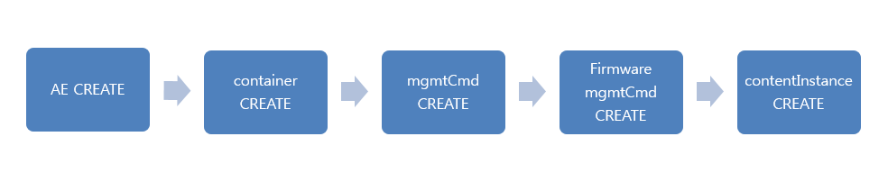

## oneM2M 등록과 주기보고 및 제어하기
본 챕터는 SKT ThingPlug Device 미들웨어를 통한 기기 등록과정과 주기보고 및 제어하기에 대하여 서술한다.

#### 등록과 주기보고
기기등록부터 주기보고까지 진행순서이다.



#### **등록**
* **AE Create**
  * 기기 등록
	```xml
	<?xml version="1.0" encoding="UTF-8"?>
	<m2m:rqp xmlns:m2m="http://www.onem2m.org/xml/protocols" xmlns:xsi="http://www.w3.org/2001/XMLSchema-instance" xsi:schemaLocation="http://www.onem2m.org/xml/protocols CDT-requestPrimitive-v1_0_0.xsd">
	<op>1</op>
	<fr>S</fr>
	<to>/~/middleware/v1_0</to>
	<ty>2</ty>
	<rqi>12345</rqi>
	<pc>
		<m2m:ae rn="device01">
			<api>[CREDENTIAL-ID]</api>
			<poa>mqtt://oneM2M/req_msg/middleware/sptektest1_device01</poa>
			<rr>true</rr>
			<ni>device01</ni>
			<mga>mqtt://sptektest1_device01</mga>
		</m2m:ae>
	</pc>
	</m2m:rqp>
	
	<m2m:rsp xmlns:m2m="http://www.onem2m.org/xml/protocols" xmlns:xsi="http://www.w3.org/2001/XMLSchema-instance"><rsc>2001</rsc><rqi>12345</rqi>
	<pc>
		<m2m:ae rn="ae-device01">
			<ty>2</ty>
			<ri>AE00000000000000000416</ri>
			<pi>CB00000000000000000056</pi>
			<ct>20170524T015218</ct>
			<lt>20170524T015218</lt>
			<acpi>AP00000000000000003663</acpi>
			<et>99991231T000000</et>
			<api>[CREDENTIAL-ID]</api>
			<aei>S000000000087020984416</aei>
			<poa>mqtt://oneM2M/req_msg/middleware/sptektest1_device01</poa>
			<rr>true</rr>
			<nl>ND00000000000000001979</nl>
			<ni>device01</ni>
			<mga>mqtt://sptektest1_device01</mga>
		</m2m:ae>
	</pc>
	</m2m:rsp>
	```
	


* **container Create**
  * 센서를 위한 container 등록
	```xml
	<?xml version="1.0" encoding="UTF-8"?>
	<m2m:rqp xmlns:m2m="http://www.onem2m.org/xml/protocols" xmlns:xsi="http://www.w3.org/2001/XMLSchema-instance" xsi:schemaLocation="http://www.onem2m.org/xml/protocols CDT-requestPrimitive-v1_0_0.xsd">
	<op>1</op>
	<fr>S000000000087020984416</fr>
	<to>/~/middleware/v1_0/ae-device01</to>
	<ty>3</ty>
	<rqi>12345</rqi>
	<pc>
		<m2m:cnt rn="LoRa">
		</m2m:cnt>
	</pc>
	</m2m:rqp>
	
	<m2m:rsp xmlns:m2m="http://www.onem2m.org/xml/protocols" xmlns:xsi="http://www.w3.org/2001/XMLSchema-instance">
	<rsc>2001</rsc>
	<rqi>12345</rqi>
	<pc>
		<m2m:cnt rn="cnt-LoRa">
			<ty>3</ty>
			<ri>CT00000000000000003997</ri>
			<pi>AE00000000000000000416</pi>
			<ct>20170524T015218</ct>
			<lt>20170524T015218</lt>
			<et>99991231T000000</et>
			<st>0</st>
			<cr>S000000000087020984416</cr>
			<cni>0</cni>
			<cbs>0</cbs>
		</m2m:cnt>
	</pc>
	</m2m:rsp>
	```

* **mgmtCmd Create**
  * 제어를 위한 mgmtCmd 등록
	```xml
	<?xml version="1.0" encoding="UTF-8"?>
	<m2m:rqp xmlns:m2m="http://www.onem2m.org/xml/protocols" xmlns:xsi="http://www.w3.org/2001/XMLSchema-instance" xsi:schemaLocation="http://www.onem2m.org/xml/protocols CDT-requestPrimitive-v1_0_0.xsd">
	<op>1</op>
	<fr>S000000000087020984416</fr>
	<to>/~/middleware/v1_0</to>
	<ty>12</ty>
	<rqi>12345</rqi>
	<pc>
		<m2m:mgc rn="device01">
			<cmt>1</cmt>
			<ext>ND00000000000000001979</ext>
		</m2m:mgc>
	</pc>
	</m2m:rqp>

	<m2m:rsp xmlns:m2m="http://www.onem2m.org/xml/protocols" xmlns:xsi="http://www.w3.org/2001/XMLSchema-instance">
	<rsc>2001</rsc>
	<rqi>12345</rqi>
	<pc>
		<m2m:mgc rn="mgc-device01">
			<ty>12</ty>
			<ri>MC00000000000000003586</ri>
			<pi>CB00000000000000000056</pi>
			<ct>20170524T015218</ct>
			<lt>20170524T015218</lt>
			<et>99991231T000000</et>
			<cmt>1</cmt>
			<exe>false</exe>
			<ext>ND00000000000000001979</ext>
		</m2m:mgc>
	</pc>
	</m2m:rsp>
	```

#### **주기보고**

* **contentInstance Create**
  * container의 contentInstance 등록
	```xml
	<?xml version="1.0" encoding="UTF-8"?>
	<m2m:rqp xmlns:m2m="http://www.onem2m.org/xml/protocols" xmlns:xsi="http://www.w3.org/2001/XMLSchema-instance" xsi:schemaLocation="http://www.onem2m.org/xml/protocols CDT-requestPrimitive-v1_0_0.xsd">
	<op>1</op>
	<fr>S000000000087020984416</fr>
	<to>/~/middleware/v1_0/ae-device01/cnt-LoRa</to>
	<ty>4</ty>
	<rqi>12345</rqi>
	<pc>
		<m2m:cin>
			<cnf>ttv</cnf>
			<con>120a41dc7efa3104016333050025</con>
		</m2m:cin>
	</pc>
	</m2m:rqp>
	
	<m2m:rsp xmlns:m2m="http://www.onem2m.org/xml/protocols" xmlns:xsi="http://www.w3.org/2001/XMLSchema-instance">
	<rsc>2001</rsc>
	<rqi>12345</rqi>
	<pc>
		<m2m:cin rn="cin-CI00000000000076394900">
			<ty>4</ty>
			<ri>CI00000000000076394900</ri>
			<pi>CT00000000000000003997</pi>
			<ct>20170524T015219</ct>
			<lt>20170524T015219</lt>
			<et>20170623T015219</et>
			<st>1</st>
			<cr>S000000000087020984416</cr>
			<cnf>ttv</cnf>
			<cs>2</cs>
			<con>120a41dc7efa3104016333050025</con>
		</m2m:cin>
	</pc>
	</m2m:rsp>
	```

#### 2. 제어 및 조회하기
다음은 actuator에 대한 제어와 제어에 대한 결과보고(sp1 방식 기준)와 Tool 을 통한 조회 및 제어 방법에 대한 설명이다.

* **제어하기**
  * 제어를 위한 actuator 는 mgmtCmd 와 함께 container 를 함께 등록한다.
  * 하나의 actuator에 대해서 command를 받을 수 있는 mgmtCmd와 더불어, command 결과를 올릴 수 있는 container를 함께 등록한다.
  * 다음은 7colorRGBLed 를 원격에서 제어할때의 요청과 결과에 대한 데이터이다.
	```xml
> PUT /ThingPlug/mgmtCmd-1.2.481.1.999.130.3000005_7colorRGBLed_10 HTTP/1.1
Host: onem2m.sktiot.com:9000
Accept: application/xml
Content-Type: application/vnd.onem2m-res+xml
X-M2M-RI: 341356
X-M2M-Origin: 1.2.481.1.999.130.3000005
dKey: OGs2RjJYZitiS1hqcmJjSHFNTG5hR1pQ***
uKey: Y1VFZDl2WGU4SW1VOFV1N0FqU1l1azVE***
<?xml version="1.0" encoding="UTF-8"?>
<m2m:mgc
xmlns:m2m="http://www.onem2m.org/xml/protocols"
xmlns:xsi="http://www.w3.org/2001/XMLSchema-instance">
<exra>{"id":"o6qscy84l","cmd":"red","options":{}}</exra>
</m2m:mgc>

HTTP/1.1 200 OK
<?xml version="1.0" encoding="UTF-8" standalone="yes" ?>
<m2m:mgcxmlns:m2m="http://www.onem2m.org/xml/protocols"
xmlns:xsi="http://www.w3.org/2001/XMLSchema-instance">
<ty>12</ty>
<ri>MC00000000000000000855</ri>
<rn>1.2.481.1.999.130.3000005_7colorRGBLed_10</rn>
<pi>ThingPlug</pi>
<ct>2016-02-03T17:36:57+09:00</ct>
<lt>2016-05-10T14:34:56+09:00</lt>
<lbl>1.2.481.1.999.130.3000005</lbl>
<et>9999-12-31T00:00:00+00:00</et>
<cmt>cmt</cmt>
<exra>{"id":"o6qscy84l","cmd":"red","options":{}}</exra>
<ext>ND00000000000000000526</ext>
</m2m:mgc>
	```

  * 다음은 위 제어요청을 통하여 실제로  Device 로 전달된 MQTT Push 메시지이다.
	```xml
<m2m:req xmlns:m2m="http://www.onem2m.org/xml/protocols" 
xmlns:xsi="http://www.w3.org/2001/XMLSchema-instance" 
xsi:schemaLocation="http://www.onem2m.org/xml/protocols
CDT-requestPrimitive-v1_0_0.xsd">
<op>1</op>
<cty>application/vnd.onem2m-prsp+xml;charset=UTF-8</cty>
<nm>1.2.481.1.999.130.3000005_7colorRGBLed_10</nm>
<fr>ThingPlug</fr>
<pc>
<exin>
<ty>8</ty>
<ri>EI00000000000000050366</ri>
<rn>EI00000000000000050366</rn>
<pi>MC00000000000000000855</pi>
<ct>2016-05-16T15:35:07+09:00</ct>
<lt>2016-05-16T15:35:07+09:00</lt>
<lbl>1.2.481.1.999.130.3000005</lbl>
<et>2016-06-16T01:00:00+09:00</et>
<exs>1</exs>
<ext>ND00000000000000000526</ext>
<exra>{"id":o6qscy84l","cmd":"red","options":{}}</exra>
<cmt>cmt</cmt>
</exin>
</pc>
</m2m:req>
	```

* **제어결과**
  * 제어 결과는 등록된 container 의 contentInstance 를 통하여 결과를 업로드 한다.
  * 다음은 7colorRGBLed를 red 색상으로 제어한 후 결과보고이다.

	```xml
> POST /ThingPlug/remoteCSE-1.2.481.1.999.130.3000005/container-7colorRGBLed_10 HTTP/1.1
Host: onem2m.sktiot.com:9000
Accept: application/xml
Content-Type: application/vnd.onem2m-res+xml;ty=4
X-M2M-RI: 341356
X-M2M-Origin: 1.2.481.1.999.130.3000005
dKey: OGs2RjJYZitiS1hqcmJjSHFNTG5hR1pQ***
locale: en
Content-Length: 248
<?xml version="1.0" encoding="UTF-8"?>
<m2m:cin xmlns:m2m="http://www.onem2m.org/xml/protocols"
xmlns:xsi="http://www.w3.org/2001/XMLSchema-instance">
<cnf>text/x-json</cnf>
<lbl>mgmt</lbl>
<con>{"id": "o6qscy84l", "result": "red"}</con>
</m2m:cin>

HTTP/1.1 201 Created
Server: Apache-Coyote/1.1
Set-Cookie: JSESSIONID=C39A2E32DECAC08FAD21982C378FE427; Path=/; HttpOnly
X-M2M-RI: 3413564d564ce1-7f3d-4908-8392-04126fb7356d
X-M2M-RSC: 2001
Content-Location: /ThingPlug/remoteCSE-1.2.481.1.999.130.3000005/container-7colorRGBLed_10/contentInstance-CI00000000000032216211
Content-Type: application/vnd.onem2m-res+xml;charset=UTF-8
Content-Length: 541
Date: Tue, 10 May 2016 05:12:14 GMT
<?xml version="1.0" encoding="UTF-8" standalone="yes"?>
<m2m:cin xmlns:m2m="http://www.onem2m.org/xml/protocols"
xmlns:xsi="http://www.w3.org/2001/XMLSchema-instance">
<ty>4</ty>
<ri>CI00000000000032216211</ri>
<rn>CI00000000000032216211</rn>
<pi>CT00000000000000001522</pi>
<ct>2016-05-10T14:12:14+09:00</ct>
<lt>2016-05-10T14:12:14+09:00</lt>
<lbl>mgmt</lbl>
<et>2016-06-10T01:00:00+09:00</et>
<at></at>
<aa></aa>
<st>47805</st>
<cr>RC00000000000000000557</cr>
<cnf>text/x-json</cnf>
<cs>38</cs><con>{"id": "o6qscy84l", "result": "red"}</con>
</m2m:cin>
	```

* **Web API testing tool 을 이용한 조회 및 제어**
  * DHC 나 Postman 등 tool 을 활용하여 조회 및 제어가 가능하다.
  * 다음은 Postman 을 이용하여 온도센서의 최신 데이터를 조회한 결과이다.
  * URL 이나 조회에 필요한 헤더 정보부분에 값이 잘못입력되는경우 404 Not Found 나 400 Bad Request 가 발생할 수 있으니 유의하자.
  * 정상 처리된 경우 우측 중앙에 200 OK 와 하단 Body 부분을 통하여 서버로부터 전달받은 센서의 시간과 온도정보를 확인할 수 있다.
  * 자세한 내용은 최신 **oneM2M 인터페이스 정의서**를 참고한다.

  * 다음은 Postman 을 이용하여 ThingPlug 서버에 7colorRGBLed actuator 의 제어를 요청한 결과이다.
  * 서버로 제어요청이 정상적으로 전달된 경우 우측 중앙에 200 OK 와 하단 Body 부분을 통하여 서버에 전달된 제어요청 내용을 확인할 수 있다.

  * 제어명령을 white 로 요청하려면 요청 Body 정보는 아래와 같은 형태로 입력하면 된다.

	```xml
<?xml version="1.0" encoding="UTF-8"?>
<m2m:mgc
xmlns:m2m="http://www.onem2m.org/xml/protocols"
xmlns:xsi="http://www.w3.org/2001/XMLSchema-instance">
<exra>{"id":"123456789","cmd":"white","options":{}}</exra>
</m2m:mgc>
	```
